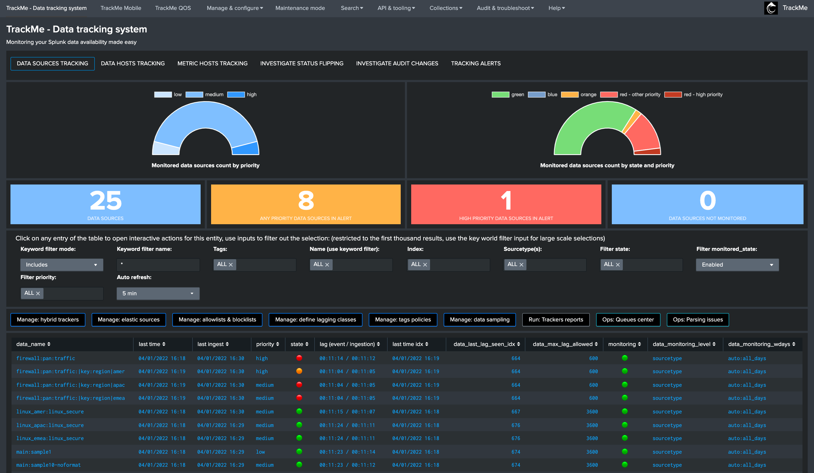
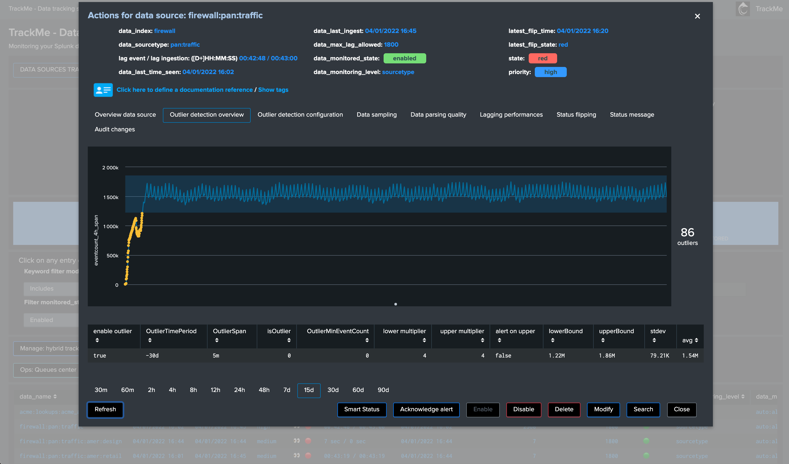

# TrackMe - Data tracking system for Splunk

| branch | build status                                                                                                                                                                     |
| ------ | -------------------------------------------------------------------------------------------------------------------------------------------------------------------------------- |
| master |  |

## Download

**Consult the application releases in Git:**

https://github.com/trackme-limited/trackme-for-splunk/releases

## TrackMe provides automated monitoring and visibility insight of your data sources, with a powerful user interface and workflow for Splunk product owners to detect and alert on lack of availability, abnormal latency, volume outliers detection and quality issues:

- Discover and store key states information of data sources, data hosts and metric hosts availability
- Track local and remote Splunk deployments at scale, with out the box and custom hybrid models
- Provides a powerful user interface to manage activation states, configuration and quickly identify data availability failures
- Analyse and detect lack of data and performance lagging of data sources and hosts within your Splunk deployment
- Behaviour analytic with outlier detection based on machine learning outliers calculations
- Behaviour analytic with data sampling and event format recognition, monitor and detect anomalies in raw events to detect event format changes or misbehaviour based on builtin rules and extended with your own custom rules
- Create elastic sources for any kind of custom monitoring requirements based on tstats / raw / mstats / from searches to fullfill any requirements
- Record and investigate historical changes of statuses, as well as administrators changes (audit flipping and changes)
- Easy administration via graphical human interface from A to Z
- No matters the purpose of your Splunk deployment, trackMe will become an essential piece of your deployment, providing key value for PCI or compliance requirements
- Keep things under your control and be the first to know when data is not available, get alerted before your users get back to you!

## Why this application?

Splunk administrators and engineers have to spend a good amount of time and energy to on-board and monitor data sources, which becomes more and more complex and time consuming with the explosion of volume and variety of data.

However, it is very frequent to realise after math that something went wrong, for some reason the sender stopped sending, an upgrade broke a configuration, a network rule was lost, an unexpected side effect of a change occurred, parsing issues are not detected...

No administrator should be informed of an issue in the data flow by the customer or the end users, this is why you need pro-activity, costless and scalable availability monitoring.

with the massive amount and variety of data sources, this becomes easily a painful and problematic activity, this application aims to drastically help you in these daily tasks.

TrackMe provides a handy user interface associated with an efficient data discovery, state and alerting workflow.

Made by Splunk admins for Splunk admins, the TrackMe application provides builtin powerful features to monitor and administer you data source monitoring the easy way!

## Use cases for TrackMe?

No matters the purpose of your Splunk deployment, trackMe will easily become an essential and positive piece of your Splunk journey:

- Security Operation Centers (SOC) with or without Enterprise Security compliance: detect lack of data, abnormal latency potentially impacting your security posture
- PCI and compliance: deliver, alert and action
- Monitoring and insight visibility about your indexes, sourcetypes, events and metrics
- General data activity monitoring and detection of Zombie data
- Continous and automated data quality assessment
- PII data detection with custom regular expression based rules and data sampling
- many more!

**Please consult the online documentation:** https://trackme-limited.github.io/trackme-for-splunk/
